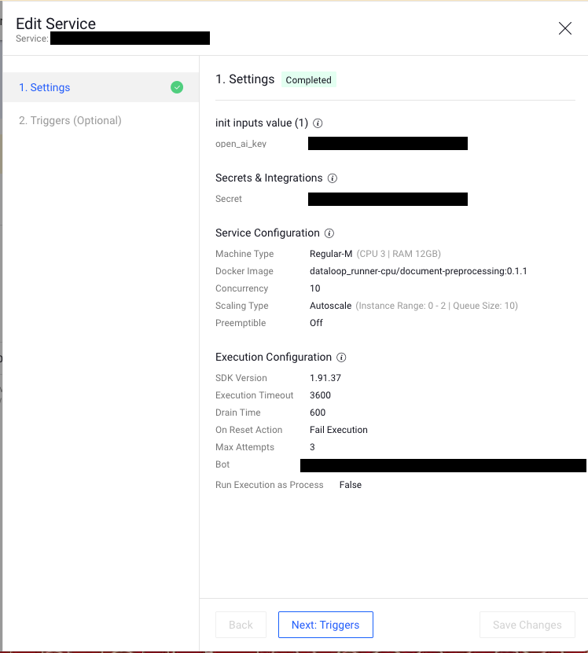

# Documents preprocessing Applications

## Introduction

This repo contains applications of pipeline nodes for preprocess document data in dataloop platform.
It also include integration between [Unstructured io](https://unstructured-io.github.io/unstructured/index.html#)
functions and [Dataloop](https://dataloop.ai/). The Unstructured library is crafted to facilitate the preprocessing and
structuring of unstructured text documents,
enabling their utilization in subsequent machine learning endeavors. It supports various document formats such as PDFs,
XML, and HTML.

## Description

The Applications provide preprocessing methods for dealing with textual datasets in order to visualize in Dataloop
platform and prepare the items to be used as an input to ML model for variety of
tasks.

The available pipeline nodes:

* ```PDF to Images``` - This app serves as pipeline node. Can be used if the user want to convert PDF data
  to images. by that it can be visualized in the platform and also can be appropriate for using computer vision models.


* ```PDF to Text``` - This app serves as pipeline node. Can be used if the user want to convert PDF data
  to text files. By that it can be visualized in the platform and also can be appropriate for using several LLM/NLP
  models.


* ```Text Preprocessing``` - This app serves as pipeline node. This app preprocess
  PDFs dataset to create clean text files. This files can be an input for nlp model or to be converted to prompt input.


* ```PPT Sanitization``` - This app creates a pipeline node that takes as input an item containing a pptx file and outputs a new presentation with 
the same general content as the original, but with no visual identity (white backgrounds and black Arial font for text),
 and the following substitutions will happen:

  * **Companies, organization, non-profit institutions** will be replaced with the tag **[Org]**
  * **Countries, cities, villages, streets, sites** will be replaced with the tag **[Location]**
  * **Personal names** will be replaced with the tag **[Person]**
  * **Project names** will be replaced with the tag **[Project]**
  * **Currency names and symbols** will be replaced with the tag **[Currency]**
  * **Numerical financial data** will be replaced with the tag **[xx]**
  * **Stock tickers** will be replaced with the tag **[Stock]**
  * **Visual identifiers** like logos and company-related themes will be replaced by **black rectangles**, indicating 
  that previously an identifier was there

In order to use this app, you will need to include a [secret](https://docs.dataloop.ai/docs/manage-secrets) for an 
[OpenAI API key](https://help.openai.com/en/articles/4936850-where-do-i-find-my-openai-api-key) in the [Dataloop 
platform](https://console.dataloop.ai). In the [service configuration](https://docs.dataloop.ai/docs/service-runtime),
add the name of the created secret as the init input ```open_ai_key``` so the service will be able to use it:



The app includes one node for the named entity recognition removal and another one for the visual identity removal.

*** In the future, similar applications will be available for different types of textual files such as: HTML, eml (
email), jsons and so on.

